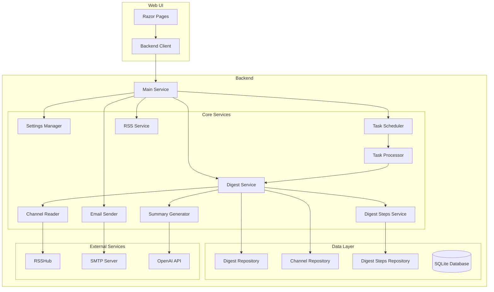

# TelegramDigest

## How-to

### Add migration

```bash
dotnet ef migrations add MIGRATIONNAME \
  --project TelegramDigest.Backend/TelegramDigest.Backend.csproj \
  --startup-project TelegramDigest.Web/TelegramDigest.Web.csproj
````

## Technologies

- .NET 9
- C# 12
- ASP.NET
- Razor Pages
- EF Core (SQLite)
- Swagger
- RSSHub for Telegram channel RSS feeds
- Built-in JSON tools
- Official dotnet OpenAI package for text summarization
- FluentResults for error handling
- System.ServiceModel.Syndication for RSS feed handling
- System.Net.Mail for email sending
- IHostedService for background tasks
- Docker Compose
- Bootstrap 5 and Bootstrap Icons

## Code style and practices

- Immutable data structures (record types)
- Code formatting (CSharpier)
- Unit and integration testing (NUnit)
- XML documentation for interfaces
- Result pattern for error handling
- Exceptions only for unreachable code (cases that should never happen)
- Strong type safety (avoiding primitive obsession)
- Data Validation via attributes

## Architecture

- Structured logging
- Global exception handlers
- Layered architecture
- Domain-driven design principles
- Controller-Service-Repository pattern in backend

The application is split into four main projects:

1. **Backend**
- **Core Services:**
  - **Channel Reader:** Fetches RSS feeds from Telegram channels
  - **Summary Generator:** Generates summaries using OpenAI API
  - **Settings Manager:** Manages application configuration
  - **Task Scheduler:** Manages background task scheduling
  - **Task Processor:** Handles concurrent task execution
  - **Email Sender:** Sends digest emails
  - **Digest Service:** Manages digest creation and storage
  - **Digest Steps Service:** Tracks digest generation progress
  - **RSS Service:** Generates RSS feeds
  - **Main Service:** Coordinates all services and serves as a facade
- **Data Layer:**
  - Entity Framework Core
  - Repository pattern
2. **Web UI**
- **Features:**
  - Digest viewing and management
  - Channel management
  - Settings configuration
  - Progress tracking
- **Technologies:**
  - Razor Pages
  - Bootstrap 5
  - Bootstrap Icons
3. **Tests**
- Unit tests
- Integration tests
- Mock-based testing
- Test data builders


