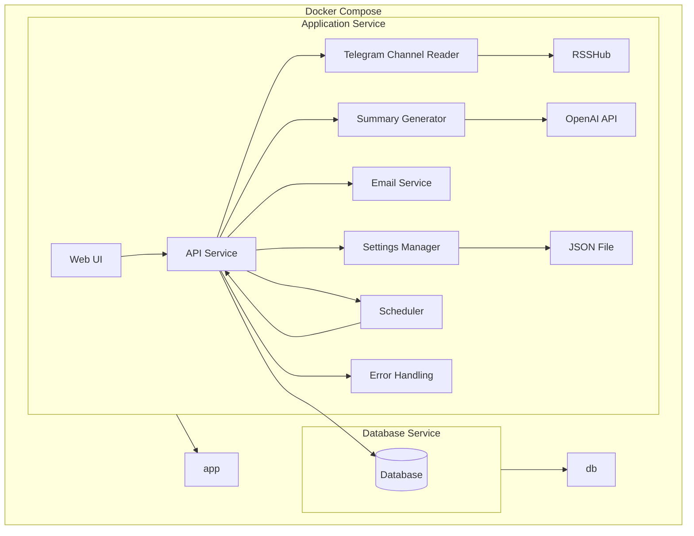

# Telegram Digest

Telegram Digest is a simple application that will create a summary digest from multiple Telegram channels and send this digest daily to my email.

### Features

- Simple web UI
  - Channels list
  - Settings
  - Digest history
  - Digest page
- Summary generation
  - Summarize posts from channels
  - Evaluate post quality and importance
  - Send summary preview to email
- Email sending
  - Email has only a link to the summary page and minimalistic text, to avoid issues with email rendering
- Telegram channels data
  - Channels are accessible via RSS feed
  - Automatic url generation as `https://rsshub.app/telegram/channel/channelname`
- Management and deployment
  - Settings are stored in json file

### Technologies

- Python 13
- FastAPI
- Jinja2
- OpenAI API
- Pydantic
- RSSHub as a way to get RSS feed from Telegram channels
- Docker Compose

### Code style and practices

- Type hints
- Pydantic models
- Static analysis (mypy)
- Linting (ruff)
- Formatting (black)
- Testing (pytest)
- Logging
- Error handling (global exception handlers)
- Readme and documentation
- Feature-based directory structure
- Avoiding primitive obsession

### Architecture

The architecture for the Telegram digest application is designed to balance simplicity and modularity, suitable for a small project with a one-week implementation timeline. The components are grouped into services based on their functionalities and interdependencies.

1. **Application Service**
   - **Responsibilities:**
     - **Web UI and API:** Provides the user interface and handles API requests.
     - **Telegram Channel Reader:** Reads RSS feeds from Telegram channels.
     - **Summary Generator:** Summarizes posts using the OpenAI API.
     - **Settings Manager:** Manages application settings stored in a JSON file.
     - **Scheduler:** Schedules daily digest generation and email sending.
     - **Email Service:** Sends daily digest emails.
     - **Logging and Error Handling:** Manages logging and error handling internally.
   - **Technologies:**
     - FastAPI for API and Web UI.
     - Pydantic for data modeling.
     - OpenAI API for summarization.
     - APScheduler for scheduling tasks.
     - SMTP client for email sending.
     - SQLAlchemy or an ORM for database interactions.

2. **Database Service**
   - **Responsibilities:**
     - Stores summaries, channels list, digest history.
   - **Technologies:**
     - SQLite or PostgreSQL for database management.



### Contracts

```
classDiagram
    class Channel {
        +id: str
        +name: str
    }

    class PostSummary {
        +id: str
        +summary: str
        +usefulness: int
    }

    class ChannelMetadata {
        +id: str
        +img_url: str
        +description: str
    }

    class ChannelsRepository {
        +add_channel(channel: Channel): void
        +remove_channel(channel_id: str): void
        +get_channels(): list[Channel]
    }

    class Database {
        +save(obj: object): void
        +retrieve(cls: Type, id: str): object
        +query(cls: Type, **kwargs): list[object]
    }

    class Post {
        +id: str
        +url: str
        +title: str
        +content: str
        +published_date: datetime
        +channel: Channel
    }

    class Digest {
        +id: int
        +created_date: datetime
        +summaries: list[PostSummary]
        +channel: Channel
    }

    class DigestRepository {
        +add_digest(digest: Digest): void
        +get_digest(digest_id: int): Digest | None
        +get_digests(from_date: datetime, to_date: datetime): list[Digest]
    }

    class Settings {
        +openai_api_key: str
        +email_from: str
        +email_to: str
        +email_password: str
        +email_server: str
        +email_port: int
    }

    class EmailSender {
        +send_digest(digest: Digest, settings: Settings): bool
    }

    class Scheduler {
        +schedule_digest_generation(settings: Settings): void
    }

    class WebUI {
        +display_channels(channels: list[Channel]): void
        +display_settings(settings: Settings): void
        +display_digest_history(digests: list[Digest]): void
        +display_digest(digest: Digest): void
    }

    class APIService {
        +get_channels(): list[Channel]
        +add_channel(channel: Channel): void
        +remove_channel(channel_id: str): void
        +get_settings(): Settings
        +update_settings(settings: Settings): void
        +get_digest_history(from_date: datetime, to_date: datetime): list[Digest]
        +get_digest(digest_id: int): Digest | None
        +generate_digest(channel_id: str): Digest
        +trigger_email_sending(digest: Digest): bool
    }

    class ChannelReader {
        +get_channel_metadata(channel: Channel): ChannelMetadata
        +get_channel_posts(channel: Channel, date: datetime): list[Post]
    }

    class SummaryGenerator {
        +generate_summary(post: Post): PostSummary
    }

    class SettingsManager {
        +load_settings(): Settings
        +save_settings(settings: Settings): void
    }

    APIService -- WebUI
    APIService -- ChannelReader
    APIService -- SummaryGenerator
    APIService -- DigestRepository
    APIService -- EmailSender
    APIService -- SettingsManager
    APIService -- Scheduler
    APIService -- ChannelsRepository

    ChannelsRepository -- Database
    DigestRepository -- Database

```

### Project structure

```
telegram_digest/
│
├── app/                             # Main application package
│   ├── __init__.py                  # Initialize package
│   ├── api.py                       # FastAPI routes
│   ├── web_ui.py                    # Web UI
│   ├── models.py                    # Data models using Pydantic
│   ├── summary_generator.py         # Summary generation logic
│   ├── email_service.py             # Email sending logic
│   ├── scheduler.py                 # Task scheduling logic
│   ├── channels_repository.py       # Data access for channels
│   ├── digests_repository.py        # Data access for digests
│   ├── database.py                  # Database access
│   ├── channel_reader.py            # RSS feed reader
│   ├── logger.py                    # Logger
│   └── settings.py                  # Load and save settings
│
├── templates/                       # Jinja2 templates for web UI
│   ├── base.html
│   ├── channels.html
│   ├── settings.html
│   ├── digest_history.html
│   └── digest_page.html
│
├── static/                          # Static files (CSS, images, etc.)
│   ├── css/
│   │   └── style.css
│   └── images/
│       └── logo.png
│
├── tests/                           # Test cases using pytest
│   ├── __init__.py
│   ├── test_api.py
│   ├── test_services.py
│   └── test_repositories.py
│
├── Dockerfile                       # Docker build configuration
├── docker-compose.yml               # Docker Compose setup
├── requirements.txt                 # Python package dependencies
├── main.py                          # Entry point for the application
├── README.md                        # Project documentation
└── prompting.md                     # Additional documentation
```
