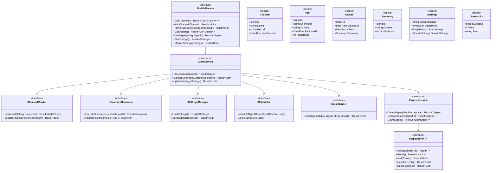

# Telegram Digest

Telegram Digest is a simple application that will create a summary digest from multiple Telegram channels and send this digest daily to my email.

### Features

- Simple web UI
  - Channels list
  - Settings
  - Digest history
  - Digest page
- Summary generation
  - Summarize posts from channels
  - Evaluate post quality and importance
  - Send summary preview to email
- Email sending
  - Email has only a link to the summary page and minimalistic text, to avoid issues with email rendering
- Telegram channels data
  - Channels are accessible via RSS feed
  - Automatic url generation as `https://rsshub.app/telegram/channel/channelname`
- Management and deployment
  - Settings are stored in json file

### Technologies

- .NET 8
- C# 12
- ASP.NET
- Razor Pages
- openai-dotnet package
- EF Core (sqlite)
- Swagger
- RSSHub as a way to get RSS feed from Telegram channels
- Built-in JSON tools
- Docker Compose

### Code style and practices

- immutable data structures (record types)
- Formatting (CSharpier)
- Testing (nunit)
- Logging
- Result pattern for error handling
- Avoid exception-based error handling
- Global exception handlers
- Readme and documentation
- Flat directory structure in each project
- Avoiding primitive obsession

### Architecture

Application is split into two dotnet projects under one solution.

1. **Application**
   - **Responsibilities:**
     - **Channel Reader:** Reads RSS feeds from Telegram channels.
     - **Summary Generator:** Summarizes posts using the dotnet openai package.
     - **Settings Manager:** Manages application settings stored in a JSON file.
     - **Scheduler:** Schedules daily digest generation and email sending.
     - **Email Sender:** Sends daily digest emails.
     - **Digests Service:** Creates/reads/writes digests/summaries/posts and uses other services to do so.
     - **Database** Stores summaries, channels list, digest history.
     - **Main Service** Coordinates all services and contains business logic.
     - **Public Facade** Serves as dotnet-level API for other dotnet projects.
   - **Technologies:**
     - dotnet openai package for summarization.
     - SMTP client for email sending.
     - Service-Repository pattern for db access.
     - EF Core (sqlite)
2. **Web UI**
   - **Responsibilities:**
     - Renders UI for the application.
     - Interacts with Application via public facade.
   - **Technologies:**
     - Separate dotnet project
     - Razor Pages

### Contracts

### Project structure
